# Vivid Midnight Theme

A VSCode theme inspired by Material Theme and [Monokai++](https://github.com/dcasella/monokai-plusplus) (by [Davide Casella](https://github.com/dcasella)).

This is my first VSCode theme and a **work in progress** project. If you have any problems or suggestions please open an [issue](https://github.com/mrGibi/vscode-vivid-midnight-theme/issues).

### Font

Font used in screenshots is Hack with ligatures. You can download it [here](https://github.com/mrGibi/vscode-vivid-midnight-theme/raw/master/LigaHack-Regular.ttf).

### iTerm theme

You can also download an iTerm theme from [here](https://github.com/mrGibi/vscode-vivid-midnight-theme/raw/master/vivid-midnight.itermcolors?inline=false).

## Screenshots

Here are some screenshots of the Vivid Midnight Theme in action:

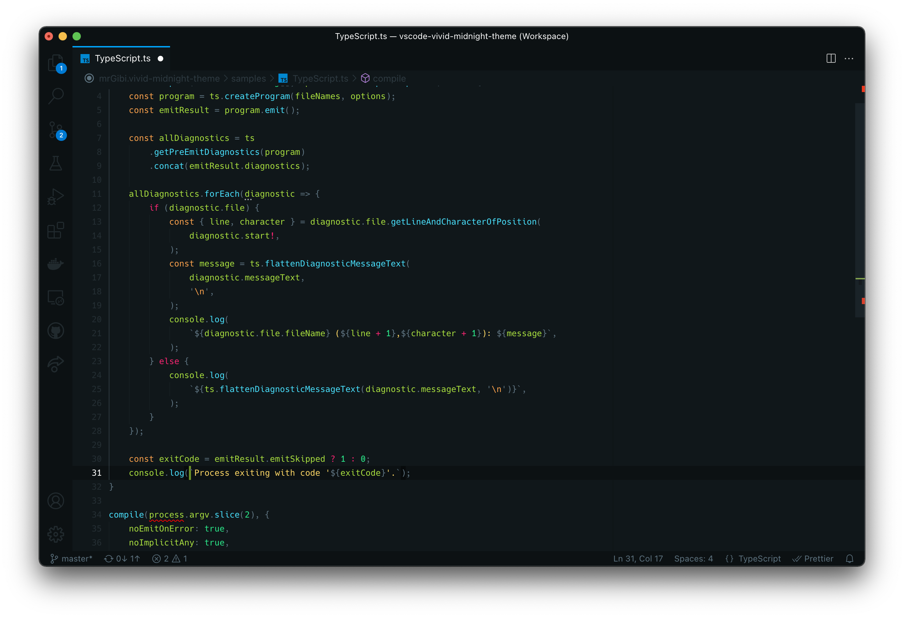
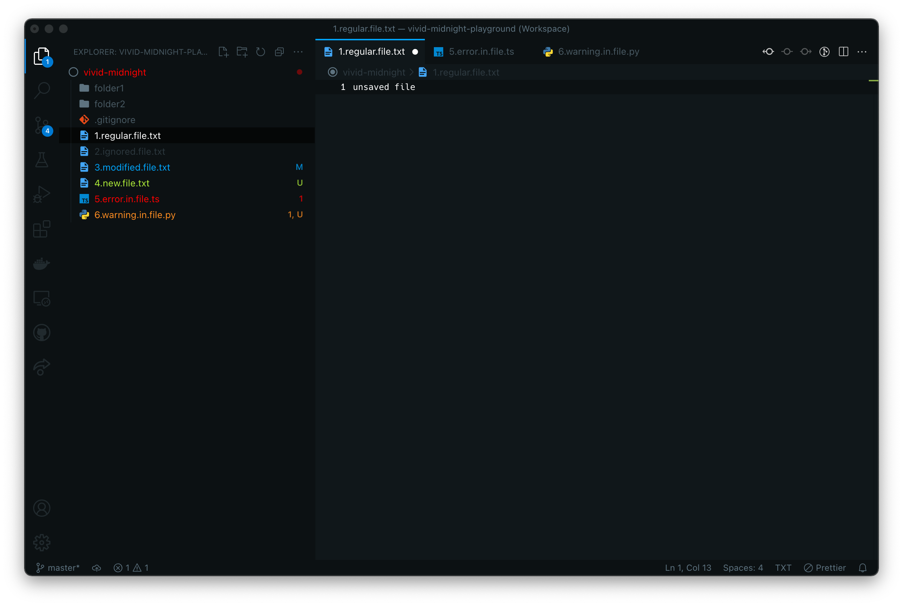
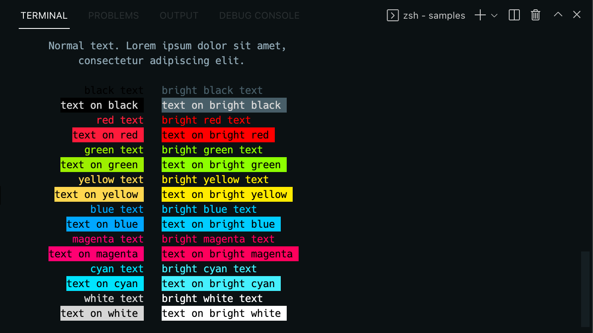
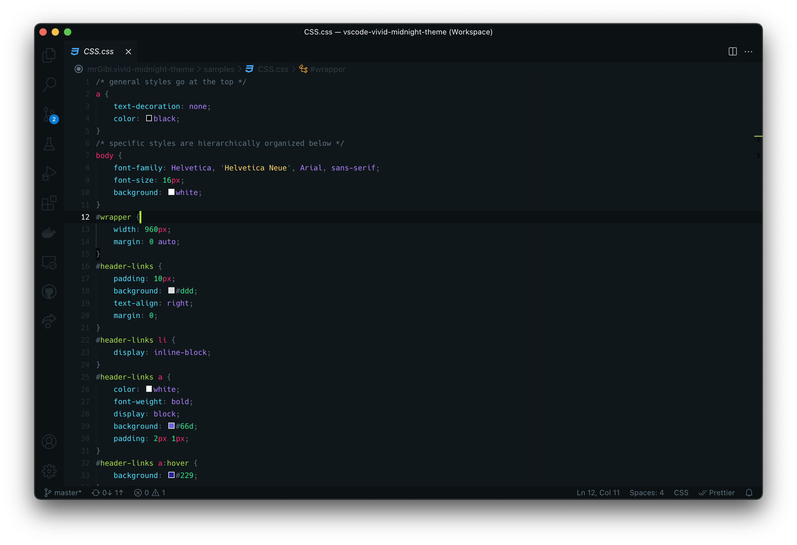
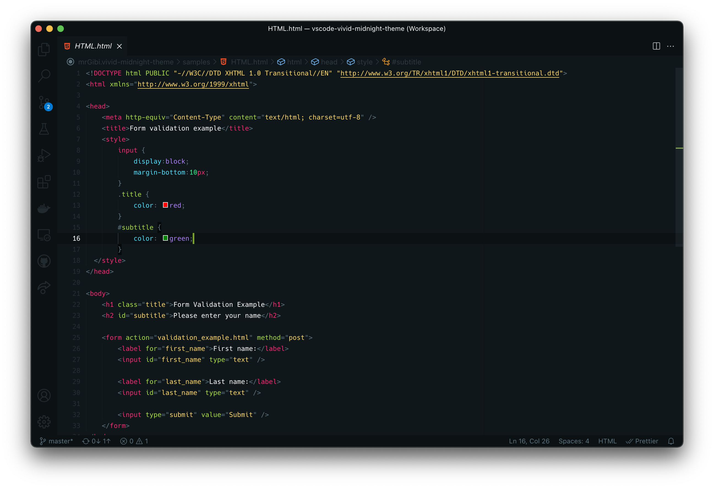
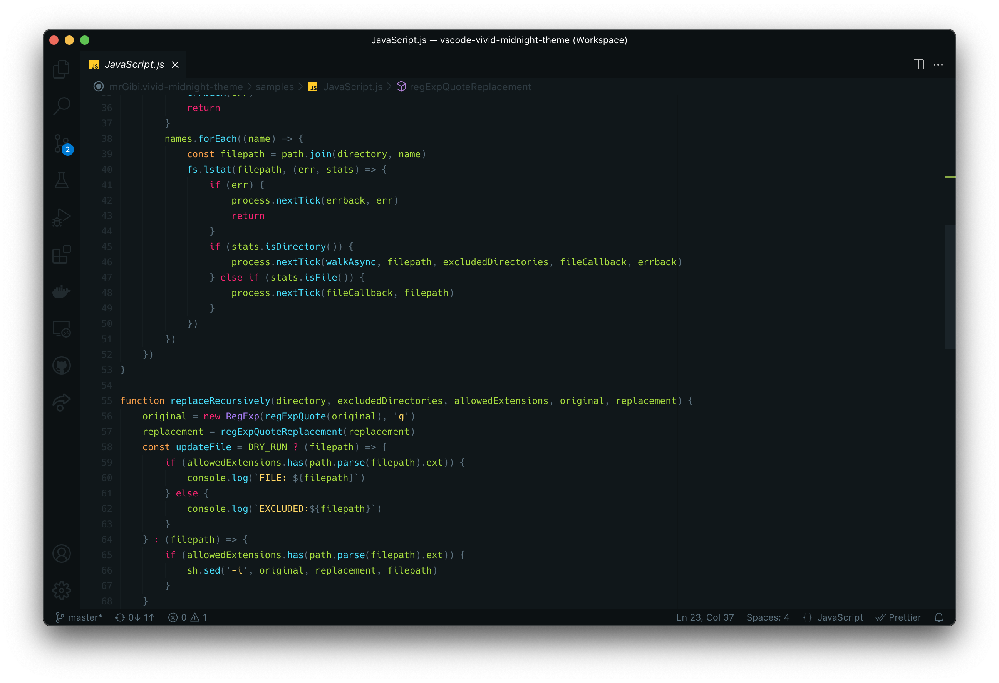
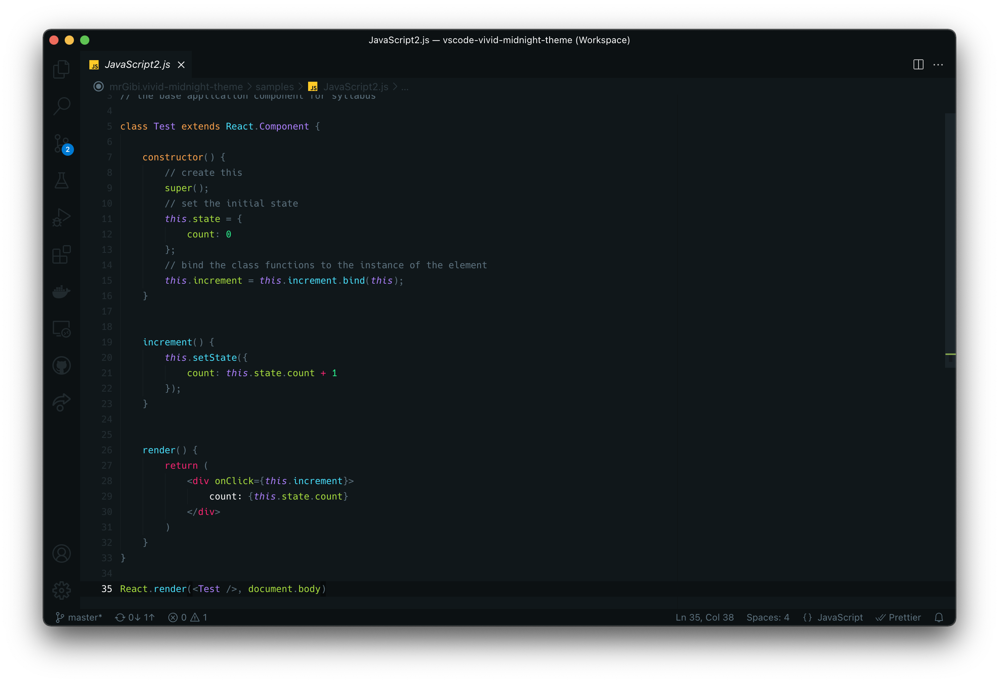
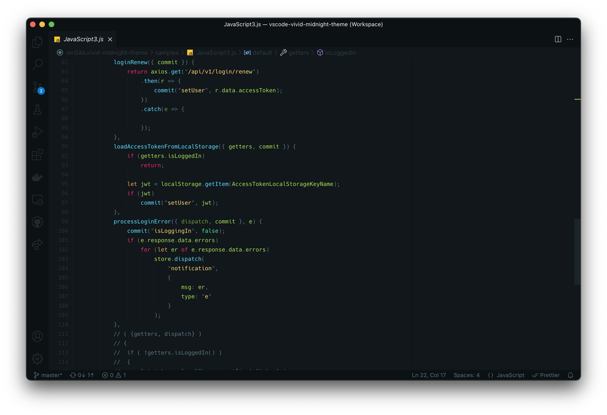
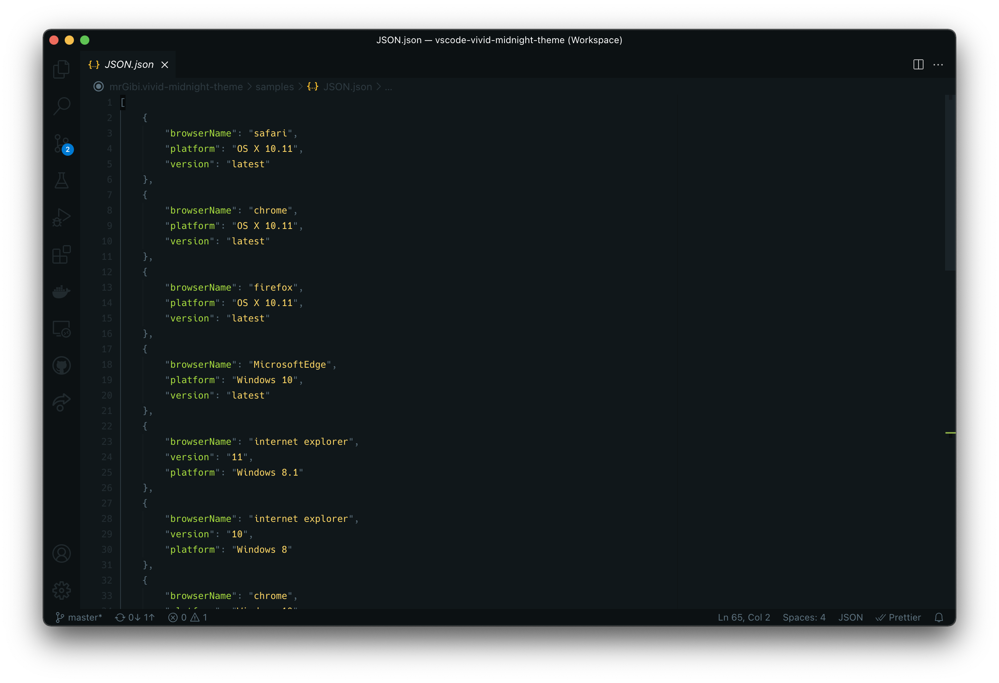
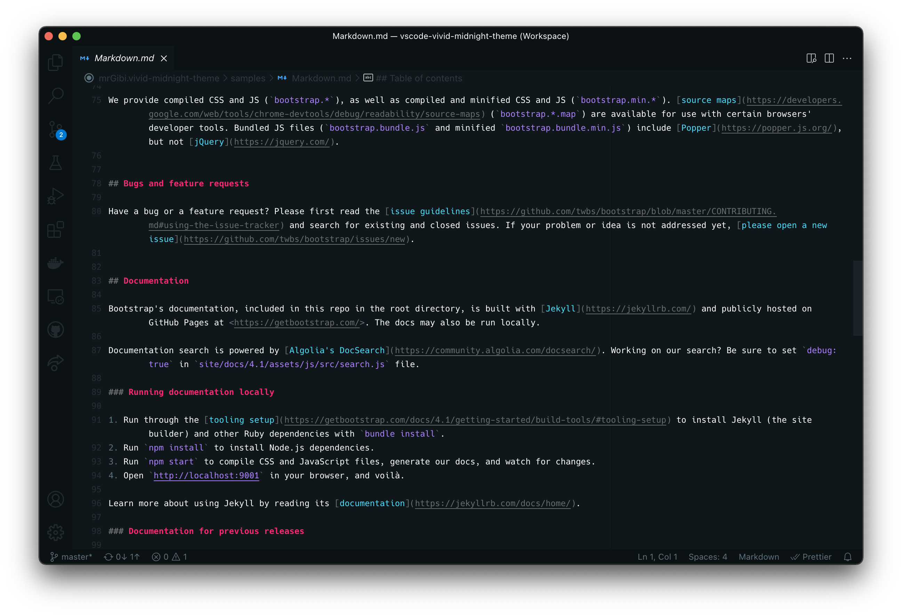
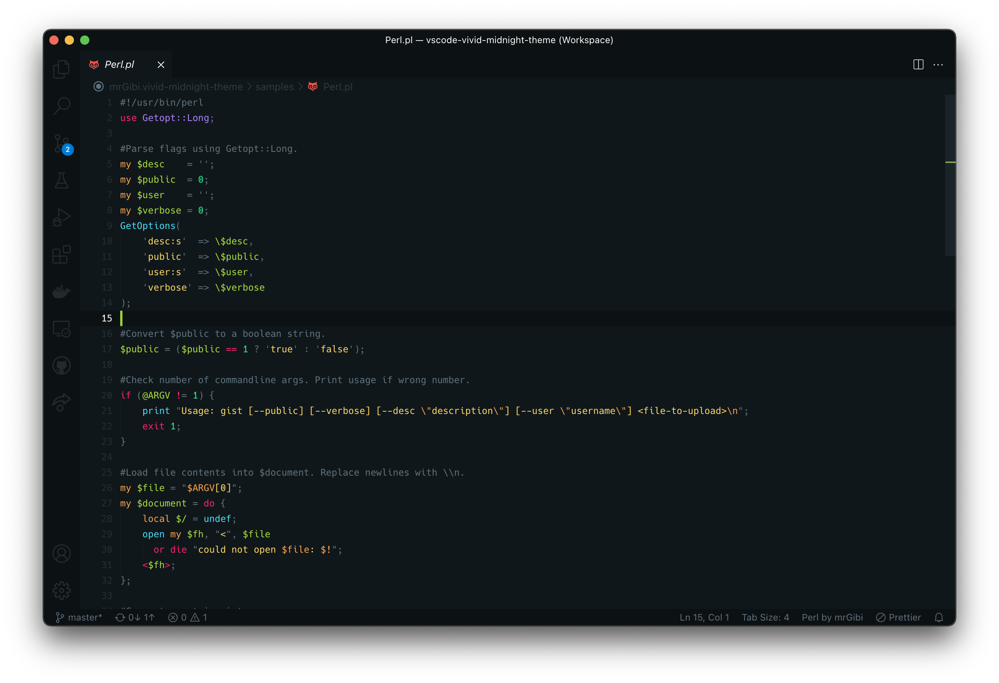
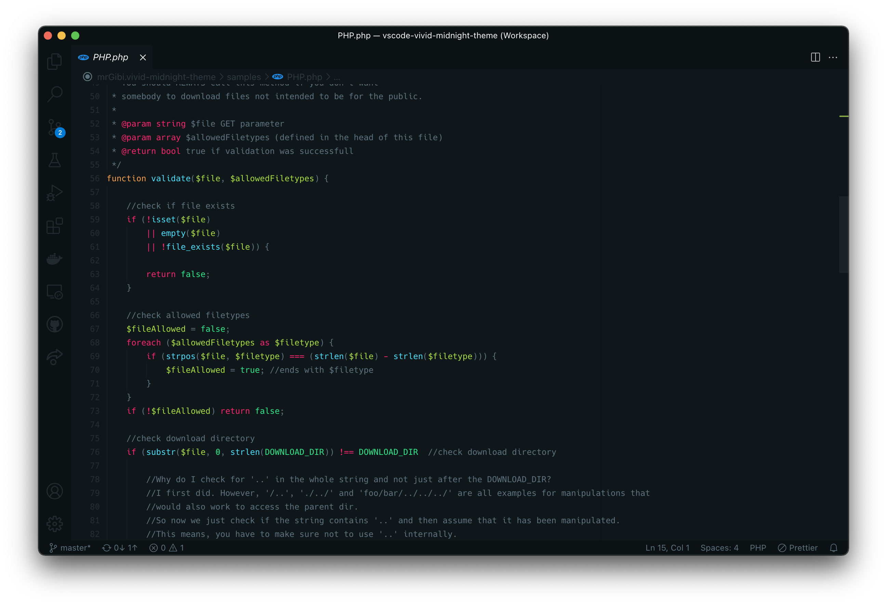
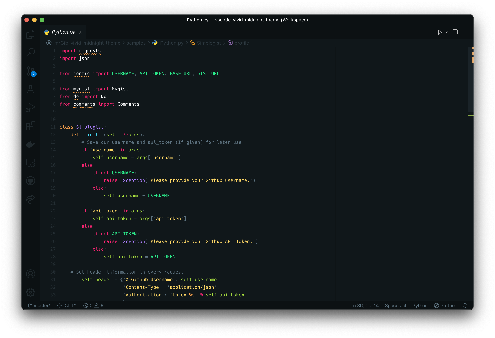
